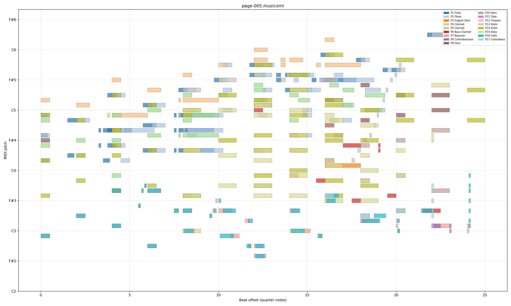
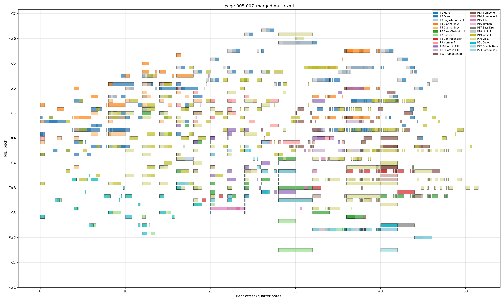

# Orchestral Score OMR Pipeline

扫描印刷管弦乐总谱的光学音乐识别（OMR）系统，输出多声部 MusicXML。

基于 [HOMR](https://github.com/liebharc/homr) 的 TrOMR 模型做逐谱表音符识别，在此之上构建了管弦乐总谱所需的**乐器识别、谱表分组、跨声部校正、多页合并**四层逻辑。

## 架构

```
输入图片 (.png)
    │
    ▼
┌─────────────────────────────┐
│  Stage 1: 谱表检测与符号分割  │  HOMR 内置的语义分割 + staff 检测
│           碎片过滤            │  过滤宽度 < 20% 中位数的窄碎片
└─────────────┬───────────────┘
              ▼
┌─────────────────────────────┐
│  Stage 1.5: 乐器名识别       │  VLM API (Qwen3-VL) 主路径
│             移调信息          │  识别 "in A/Bb/F" 等移调标记
│                             │  RapidOCR + 缩写字典 备用路径
└─────────────┬───────────────┘
              ▼
┌─────────────────────────────┐
│  Stage 2: 逐谱表识别         │  HOMR TrOMR transformer
│           N parts × M sys   │  按乐器数强制均分谱表
└─────────────┬───────────────┘
              ▼
┌─────────────────────────────┐
│  Stage 3: 跨声部后处理       │  Layer 0: 拍号推断（无拍号时从音符时值推算）
│                             │  Layer 1: 拍号/调号多数投票对齐
│                             │  Layer 2: 小节数统一
│                             │  Layer 3: 时值修正（position tracking）
│                             │  + 记谱溢出修复 / 三连音标记 / 双dot清理
└─────────────┬───────────────┘
              ▼
┌─────────────────────────────┐
│  Stage 4: 力度标记检测        │  RapidOCR 检测谱表下方力度文字
│                             │  pp/p/mp/mf/f/ff/fff/sfz 等
│                             │  定位到小节，注入 <direction> 元素
└─────────────┬───────────────┘
              ▼
         MusicXML 输出
```

## 与原始 HOMR 的区别

| 功能 | HOMR | 本项目 |
|---|---|---|
| 乐器识别 | 无（Part 1, Part 2...） | VLM API + RapidOCR 缩写字典 |
| 移调乐器 | 不支持 | 自动检测调性，注入 `<transpose>` 元素 |
| 力度标记 | 不支持 | RapidOCR 检测 + 小节定位注入 |
| 谱表分组 | 几何检测（密集总谱易出错） | OCR 确定声部数 → 强制均分 |
| 跨声部校正 | 无 | 多层后处理（拍号推断/对齐/结构/时值/溢出修复） |
| 多页合并 | 不支持 | 乐器并集 + divisions 归一化 + 小节拼接 |
| MIDI 音色 | 通用钢琴 | 按乐器分配正确的 instrument-sound 和 midi-program |
| 鲁棒性 | 窄碎片崩溃 | 自动过滤 + 质量检查报告 |

## 乐器与谱表识别流程

### 整体架构

```
输入图片
    │
    ▼
┌───────────────────────────────────────────────┐
│ 1. 谱表检测 (HOMR SegNet)                       │
│    → staffs_sorted: 按 y 排序的谱表列表           │
└───────────────────┬───────────────────────────┘
                    ▼
┌───────────────────────────────────────────────┐
│ 2. 括号/大括号检测                                │
│    → bracket_groups: 谱表分组 [[0,1],[2],...]    │
│    → system_groups: 行划分 [[s0..s12],[s13..]]   │
└───────────────────┬───────────────────────────┘
                    ▼
┌───────────────────────────────────────────────┐
│ 3. OCR 扫描左边栏 (RapidOCR)                     │
│    → ocr_hint: "Fl.", "Klar. 1.in A", ...       │
│    若 ocr_hint 为空 → 跳过 VLM，返回 []           │
└───────────────────┬───────────────────────────┘
                    ▼
┌───────────────────────────────────────────────┐
│ 4. VLM 识别 (Qwen3-VL-235B)                     │
│    输入: 第一 system 裁切图 + ocr_hint + 谱表数    │
│    输出: ["Flute", "Clarinet:A", "Horn:F", ...]  │
│    验证: ≥50% 名字在 INSTRUMENT_MIDI 中           │
│    失败 → RapidOCR 备用路径                       │
└───────────────────┬───────────────────────────┘
                    ▼
┌───────────────────────────────────────────────┐
│ 5. 跨页传播 & Override 匹配                       │
│    第一页结果 → detected_names                    │
│    后续页 OCR 为空 → 直接复用 detected_names       │
│    后续页谱表数不同 → 子序列匹配 + 音高验证         │
└───────────────────────────────────────────────┘
```

### Stage 3: OCR 预扫描（OCR-gated VLM）

`_ocr_margin_labels` 用 RapidOCR 扫描谱表左侧区域，提取文字标签并按 y 坐标排序。扫描范围限定在第一个 system 的 y 区间内，避免后续 system 的标签干扰。

**关键设计**：若 OCR 未检测到任何标签（`ocr_hint` 为空），说明该页没有乐器标注（管弦乐总谱中常见——只有第一页/第一 system 有标注），此时**跳过 VLM 调用**，直接返回空列表 `[]`。这避免了 VLM 在无标签页面上胡乱猜测乐器名。

```
页面有标签 → OCR 提取 → 传给 VLM 做精确识别
页面无标签 → OCR 返回空 → 跳过 VLM → 返回 [] → 由跨页传播机制复用第一页名字
```

### Stage 4: VLM 乐器识别

#### 名称与移调分离

VLM 返回 `Name:Key` 格式，将乐器名和移调调性分开：

| VLM 返回 | 解析结果 |
|---|---|
| `Clarinet:A` | base=`Clarinet`, key=`A` |
| `Horn:F` | base=`Horn`, key=`F` |
| `Trumpet:Bb` | base=`Trumpet`, key=`Bb` |
| `Violin` | base=`Violin`, key=`None` |
| `Timpani:E` | base=`Timpani`, key=`E`（不移调，见下文） |

`_parse_instrument_key` 同时支持 `Name:Key`（VLM 格式）和 `Name in Key`（旧格式/显示格式）两种写法。

#### VLM Prompt 设计要点

1. **视觉谱表计数**：VLM 通过图像中实际的五线谱位置来分配乐器名，而不是根据标签上的数字（如 "Oboen 1.2"）展开。这解决了 "一个标签覆盖两个谱表" vs "一个标签旁只有一个谱表" 的歧义。
2. **德文缩写表**：内置 Fl./Ob./Kl./Fg./Hr./Trp./Pos./Pk. 等德文缩写到标准名的映射。
3. **Key 的德文规则**：`B` = B♭, `H` = B♮。

### 移调处理

#### 计算方式

移调值由调性字母**计算**得出（`_compute_transpose`），而非查表：

```python
_KEY_SEMITONES = {"C": 0, "D": 2, "Eb": 3, "E": 4, "F": 5, "G": 7, "A": 9, "Bb": 10, ...}
```

- **方向规则**：Horn/English Horn 始终向下移（如 F → chromatic=-7）；其他乐器取最近方向（semitones > 6 时向下）。
- **八度补偿**：Bass Clarinet 额外 octave-change=-1。
- **仅限已知移调乐器**：只有 `DEFAULT_TRANSPOSE_KEY` 中列出的乐器（Clarinet, Bass Clarinet, Horn, Trumpet, English Horn）才会生成 `<transpose>` 元素。即使 VLM 为 Timpani 返回了 `Timpani:E`（从乐谱上的 "Pauke in E tief" 识别），也不会产生错误的移调。

#### DEFAULT_TRANSPOSE_KEY（未检测到调性时的默认值）

| 乐器 | 默认调 |
|---|---|
| Clarinet | B♭ |
| Bass Clarinet | B♭ |
| Horn | F |
| Trumpet | B♭ |
| English Horn | F |

### System 检测与合并

#### system 划分

`_detect_system_breaks` 通过谱表间的垂直间距和括号位置来划分行（system）。

#### 碎片合并

后处理会合并被错误拆分的 system：当相邻的小组谱表数之和等于第一个 system 的谱表数时，自动合并。

```
检测结果: [13, 9, 4]  →  合并为: [13, 13]
                          ↑ 因为 9+4=13=第一组的大小
```

### Multi-system 页面处理

当一页包含多个 system 且谱表数不同时（如 system 1 有 5 个谱表、system 2 有 13 个），进入 multi-system 模式：

1. **System 0**：使用 OCR→VLM 检测到的 `part_names`
2. **System 1+**：调用 `_ocr_extra_system_names`，裁切左边栏图像给 VLM，在已知乐器名列表（`master_names`）中匹配
   - `master_names` 优先使用跨页传播的 `part_names_override`（完整乐器列表），而非当前页 OCR 检测到的部分名字
   - 验证时用 `_instrument_base` 比较，使 `Horn` 能匹配 `Horn:F`
3. **Override 匹配**：所有 system 的名字都会与 `part_names_override` 做子序列匹配（`_match_override_to_detected`），确保名字带有正确的移调 key，并识别出 tacet（休止）的乐器

### 跨页乐器名传播

```python
# main() 中的核心逻辑
detected_names = None
for img in pages:
    _, names = run_pipeline(img, out, part_names_override=detected_names)
    if detected_names is None and names:
        detected_names = names   # 第一页的结果作为后续页的 override
```

1. **第一页**：正常 OCR→VLM 检测，结果存入 `detected_names`
2. **后续页**：
   - 若 OCR 检测到标签 → VLM 识别 → 与 `detected_names` 做 override 匹配
   - 若 OCR 无标签 → 跳过 VLM → 直接复用 `detected_names`
3. **Override 匹配算法** (`_match_override_to_detected`)：当 override 有 N 个名字但当前页只有 M 个谱表（M < N，部分乐器 tacet）时，遍历 C(N,M) 种子序列组合，按名字匹配度 + 音高范围验证选出最佳匹配，同时报告哪些乐器 tacet

### 显示名称

`_display_name` 将内部格式转为 MusicXML 显示名：`Clarinet:A` → `Clarinet in A`。用于 `<part-name>` 和 `<instrument-name>` 元素。

## 安装

```bash
pip install -r requirements.txt
```

**VLM API 配置**（可选，用于乐器名识别的主路径）：

```bash
cp .env.example .env
# 编辑 .env，填入 API_KEY 和 BASE_URL
```

不配置 VLM 时，自动退回到 RapidOCR 识别乐器名。也可用 `--no-vlm` 强制使用 OCR 路径。

## 使用方法

### PDF 一键转换（推荐）

`run_score.py` 是端到端的入口脚本，从 PDF 到最终合并的 MusicXML 一条龙完成：

```bash
# 基本用法：PDF + 起止页号（1-based，闭区间）
python run_score.py Bruckner7.pdf 1 3

# 自定义输出路径
python run_score.py Tchai1.pdf 3 5 -o tchai_mvt1.musicxml

# 单页
python run_score.py Brahms4.pdf 93 93

# 更高分辨率（默认 300 DPI）
python run_score.py score.pdf 1 10 --dpi 400
```

默认输出到 `outputs/{pdf名}_{起始页}_{结束页}.musicxml`，中间产物（逐页 PNG 和 MusicXML）存在 `outputs/{pdf名}/` 下。

内部流程：
1. `pdf2image` 将指定页渲染为 PNG
2. 逐页调用 `run_pipeline`，自动跨页传播乐器名
3. 多页时调用 `merge_pages` 合成最终 MusicXML

| 参数 | 说明 |
|---|---|
| `pdf` | PDF 文件路径 |
| `start` | 起始页号（1-based，包含） |
| `end` | 结束页号（1-based，包含，等于 start 时只转一页） |
| `-o, --output` | 输出 .musicxml 路径（默认 `outputs/{stem}_{start}_{end}.musicxml`） |
| `--dpi` | PDF 渲染 DPI（默认 300） |
| `--no-gpu` | 禁用 GPU 推理 |
| `--no-vlm` | 禁用 VLM，使用 RapidOCR 识别乐器名 |

### 底层接口：pipeline.py

如果已有裁好的 PNG 页面图片，可以直接调用 `pipeline.py`：

```bash
# 单页识别
python pipeline.py score_page.png -o output.musicxml --check

# 多页合并（自动跨页传播乐器名）
python pipeline.py page5.png page6.png page7.png -o merged.musicxml --check

# 批量处理目录（不合并）
python pipeline.py image_directory/ --check
```

### 编程接口

```python
from pipeline import run_pipeline, merge_pages

# 单页，指定乐器名（跳过 VLM/OCR 识别）
run_pipeline("page.png", "out.musicxml", part_names_override=[
    "Flute", "Clarinet:A", "Horn:F", "Violin", ...
])

# 多页跨页传播
detected_names = None
for img in pages:
    _, names = run_pipeline(img, out, part_names_override=detected_names)
    if detected_names is None and names:
        detected_names = names
merge_pages(page_xmls, "merged.musicxml")
```

pipeline.py 参数：

| 参数 | 说明 |
|---|---|
| `-o, --output` | 输出路径（默认与输入同名 .musicxml） |
| `--check` | 运行质量检查（音域/时值异常报告 + piano roll 图） |
| `--no-vlm` | 禁用 VLM API，使用 RapidOCR 识别乐器名 |
| `--no-gpu` | 禁用 GPU 推理 |

## 示例输出

**单页（Mahler 7, page 5）— 17 声部，5 小节：**



**多页合并（pages 5-7）— 22 声部，15 小节：**



## 已知局限

- **VLM 谱表计数**：VLM 偶尔将大括号内的谱表数数错（多或少 1），导致乐器名错位。可通过 `part_names_override` 手动指定乐器名绕过。
- **Tremolo 记谱**：TrOMR 无法识别 tremolo（成对黑块），产生空声部。这是模型训练数据的限制。
- **多页声部匹配**：依赖乐器名精确匹配。如果同一乐器在不同页面被 VLM 识别为不同名称，会被视为不同声部。
